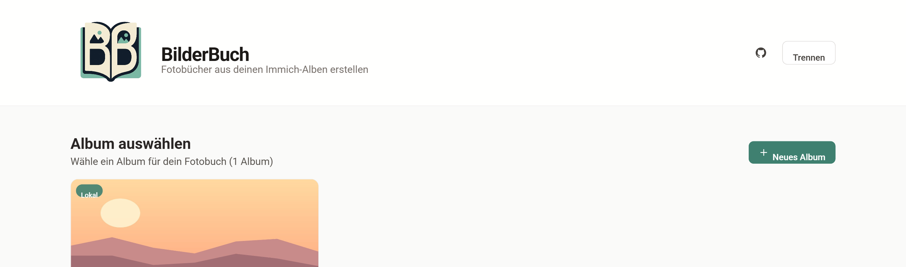
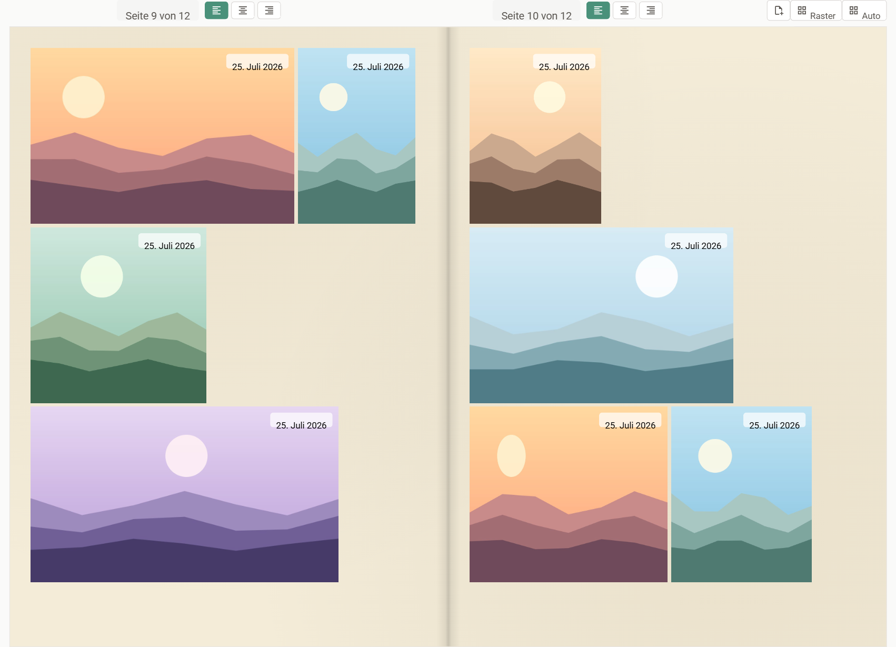
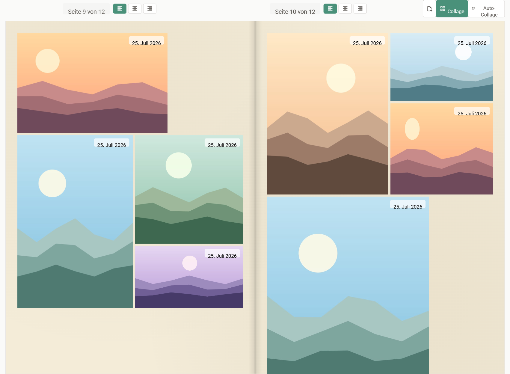
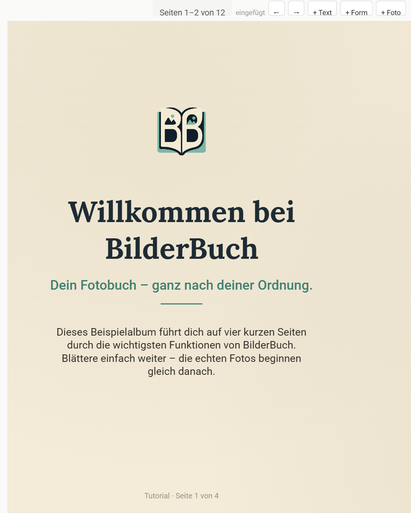

<p align="center">
  
</p>

<h1 align="center">BilderBuch</h1>

<p align="center">
  Create print-ready <strong>photo books</strong> — from your
  <a href="https://immich.app/">Immich</a> albums <em>or</em> your own uploaded photos.<br />
  Self-hosted, privacy-first, with high-quality PDF export.<br />
  Runs as a <strong>portable Windows app</strong> — or via Docker for your whole network.
</p>

<p align="center">
  <a href="#why-bilderbuch">Why</a> ·
  <a href="#download">Download</a> ·
  <a href="#screenshots">Screenshots</a> ·
  <a href="#features">Features</a> ·
  <a href="#self-hosting">Self-hosting</a> ·
  <a href="#using-bilderbuch">Usage</a> ·
  <a href="#license">License</a>
</p>

---

## Why BilderBuch?

Turn curated photo collections into professional-quality photo books you can print or share as PDFs — using photos from Immich or uploaded directly.

- **Privacy-first** — your photos stay on your own server
- **Immich _or_ standalone** — build books from Immich albums, or from your own uploads (no Immich required)
- **No subscriptions** — free and open source (AGPL-3.0)
- **Print anywhere** — export high-quality, print-ready PDFs

## Download

### Windows — portable, no installation

**[⬇ Download `bilderbuch.exe`](https://github.com/Faeslich8/bilderbuch/releases/latest/download/bilderbuch.exe)**  ·  [all releases](https://github.com/Faeslich8/bilderbuch/releases)

One file, double-click, done — no installer, no Docker, no Node.js required, no
registry entries. It even runs from a USB stick. A console window shows the
address and your default browser opens automatically.

- Works **without Immich** right away (local albums from your own uploads).
- To connect Immich, drop a `bilderbuch.config.json` next to the executable —
  see [`portable/README.md`](portable/README.md). It ships the same same-origin
  `/api` proxy as the Docker image, so **Immich needs no CORS configuration**.
- All albums, books and photos live in a `bilderbuch-daten/` folder next to the
  executable — back that up and your books are safe.

> The executable is unsigned, so Windows SmartScreen shows an "unknown publisher"
> prompt on first launch (*More info → Run anyway*). By default it listens on
> `127.0.0.1` only.

### Server / network use

For always-on use where **every device** shares the same books, run the Docker
image instead — see [Self-hosting](#self-hosting).

## Screenshots

<p align="center">
  
  <br /><em>Pick an Immich album — or create a local one from your own uploads.</em>
</p>

<p align="center">
  
  <br /><em>Grid layout: justified rows, continuous page numbering, per-page controls.</em>
</p>

<p align="center">
  
  <br /><em>Collage mode — switchable per page: tall tiles span rows, neighbours stack with aligned bottoms.</em>
</p>

<p align="center">
  
  <br /><em>Inserted pages are free canvases for text, shapes and photos — and can be auto-arranged as grid or collage.</em>
</p>

<sub>Screenshots use the neutral example album that ships with the app.</sub>

## Features

### Albums & Connection

- **Immich albums** — browse and select from all your albums via a same-origin `/api` proxy (no server URL to enter)
- **Local albums** — create books from your **own uploaded photos**; works **entirely without Immich** ("start without Immich"), rename/delete on the start page
- **Import from Immich** — copy photos into a local album, including the ones that are **not in any album** yet
- **Zero-input for the whole network** — optional central API key (`IMMICH_API_KEY`) so every device connects automatically
- **Shared editing state across devices** via a small central store — no more per-device divergence

### Layout

- **Grid (justified) layout** using @immich/justified-layout-wasm
- **Collage / masonry mode** — tiles of different heights, aspect-preserving; a tall tile spans rows while neighbours stack, bottoms aligned
- **Switchable per page** — mix grid and collage spreads in one book without re-paginating the rest
- **Automatic page design** — detects scenes from capture time and place, highlights standout photos, picks grid or collage per page. Uses the results Immich already computed (faces, favourites, ratings) plus local heuristics; **nothing is sent anywhere**
- Page formats: **DIN A3–A6** plus custom dimensions, portrait/landscape
- **Single- and double-page (open-book) view**, with continuous page numbering across inserted pages
- Adjustable layout parameters (margin, row height, spacing); configurable page background; per-album configuration with global fallback

### Photo Customization

- Drag borders to change a photo's aspect ratio; drag & drop to reorder (drop on the left or right half of a neighbour)
- **Per-image alignment** — align a single photo left/center/right within the free space of its row
- **Rotate in 90° steps** — the aspect ratio rotates with it, so the row reflows instead of cropping
- **Show/hide the capture date** per photo (the button's tooltip shows the date either way)
- In collage mode, mark a photo as a **tall tile** (spans rows)
- **Crop / reposition** the visible section of a photo
- **Detach a photo from the auto-layout** for free placement, resizing and rotation
- Custom captions with text styling (size, font, color, background)

### Design Elements

- **Blank pages and design/blank spaces** ("Leerräume") insertable at any position — with **auto-arrange as grid or collage** and a one-click **transparent background**
- **Drawing zones** — sketch with pen/finger/mouse into a blank space
- **Insertable, zoomable map** showing the GPS coordinates of a page's photos, in the Immich map style
- **Title page** with image, title/subtitle, own text styling and portrait/landscape option
- Free **text fields, shapes and emoji** with size, color, alignment and a choice of fonts — sans, serif, mono and an ornate **script** face

### Preview & Export

- Live preview with actual page layout and dimensions
- High-quality PDF export using @react-pdf/renderer (single source of truth for web + PDF)
- **Fullscreen presentation** for TV and tablet — page-turn animation, arrow keys / remote, swipe, tap zones
- **Undo** the last five editing steps (button or Ctrl+Z)
- Clean, responsive UI built with React and Tailwind CSS

## Using BilderBuch

1. **Open the app**
   - If a central `IMMICH_API_KEY` is configured, you're connected automatically — nothing to enter.
   - Otherwise enter your Immich API key and click **Connect** (no server URL needed — it's same-origin).
   - No Immich? Click **"Start without Immich"** to use local albums only.

2. **Pick or create an album**
   - **Immich album** — click any album to open it.
   - **Local album** — click **New album**, give it a name, then **Add photos** (drag & drop or file picker), or **From Immich** to copy photos over. Rename/delete local albums from their card on the start page.

3. **Choose the page layout**
   - **Single / Double** — single pages or an open-book spread.
   - **Grid / Collage** (global default) — grid = justified rows; collage = tiles of varying heights (aspect-preserving).
   - **Per page** — each spread has its own **Grid/Collage** toggle, so you can mix layouts without re-paginating the rest.
   - **Settings (gear)** — page format (DIN A3–A6 or custom), margin, row height, spacing, page background, dates/descriptions, exclude videos.

4. **Arrange photos**
   - **Drag & drop** to reorder — drop on the **left or right half** of a neighbour to place it before or after.
   - Drag a photo's **left/right border** to change its aspect ratio.
   - Per-photo hover toolbar: **alignment**, **rotate 90°**, **crop**, **caption**, **show/hide date**, **detach**, **blank space**, **map**, **remove**.
   - **Auto** (per page, grid) resets manual sizes so the row redistributes evenly; **Auto‑Collage** turns the page into a masonry.

5. **Add design elements** (Insert menu)
   - **Blank page** / **blank space** ("Leerraum"), **text**, **shape/emoji**, a **drawing zone**, or an **insertable map** showing the GPS coordinates of a page's photos.
   - Add a **title page** with image, title/subtitle and portrait/landscape option.
   - On an inserted page, use **Arrange: Grid | Collage** to lay its photos out automatically.

6. **Export**
   - Click **Generate PDF** for a print-ready preview, download from the viewer toolbar, and **Back to editor** to keep editing.
   - Your edits are saved automatically and shared across devices via the central store.

## Self-hosting

The portable executable above needs no setup. For always-on use on a server —
so every device in your network shares the same books — use Docker.

### Docker (recommended)

A `Dockerfile` and `docker-compose.yml` are included. The image builds the static
site and nginx serves it **and** proxies `/api/` same-origin to your Immich server
(via `IMMICH_URL`, e.g. `http://immich-server:2283` when both containers share a
Docker network). Because the browser only ever talks to this one origin,
**no CORS configuration on Immich is needed**.

```bash
docker compose up --build -d
```

The app is then available on <http://localhost:8080>.

**Zero-input for the whole network:** set `IMMICH_API_KEY` in
`docker-compose.yml` / `portainer-stack.yml`. It is delivered to the browser at
load time (`/config.js`), so **every device connects automatically**. Leave it
empty to have each device prompt for its own key.

> **Security note:** the injected key is served in plaintext to anyone who can load
> the page. Prefer a **dedicated** Immich API key (not your admin key), since anyone
> on your LAN who opens the app gains that access.

**Shared editing state:** the container serves a small WebDAV file store under
`/store/`, backed by the `immichbook-store` volume. Each album's editing state
(ordering, aspect ratios, blank spaces, maps, title page, …) lives there, so
**every device sees the same progress**. `localStorage` stays a local cache;
if the store is unreachable the app just works per-device. Conflicts resolve
last-write-wins. Keep the `immichbook-store` volume to preserve books across
redeploys.

**Pre-built image (Portainer):** pushes to `main` publish
`ghcr.io/<owner>/bilderbuch:latest` via `.github/workflows/docker-image.yml`.
Paste [`portainer-stack.yml`](portainer-stack.yml) into Portainer's stack editor
and adjust `IMMICH_URL`, `IMMICH_API_KEY` and the network name.

<details>
<summary><strong>Getting an Immich API key</strong></summary>

<br />

You need an Immich API key with these permissions:

- `album.read` — browse and list albums
- `asset.read` — read asset metadata (descriptions, dates, …)
- `asset.view` — access photo thumbnails and images

1. Log into your Immich instance
2. Go to **Account Settings** → **API Keys**
3. Click **New API Key**
4. Give it a descriptive name (e.g. "BilderBuch")
5. Select the permissions above
6. Click **Create** and copy the key (you won't be able to see it again)

</details>

<details>
<summary><strong>Other deployment options (subdirectory / subdomain / build it yourself)</strong></summary>

<br />

First, build the application:

```bash
git clone https://github.com/Faeslich8/bilderbuch.git
cd bilderbuch
npm install
npm run build
```

#### Subdirectory deployment

Deploy to a subdirectory of your Immich domain (e.g. `https://photos.example.com/book/`):

```nginx
location /book/ {
    alias /path/to/bilderbuch/dist/;
    try_files $uri $uri/ /book/index.html;
}
```

#### Subdomain deployment

Deploy to a subdomain (e.g. `https://book.photos.example.com/`):

```nginx
server {
    server_name book.photos.example.com;
    root /path/to/bilderbuch/dist;
    try_files $uri $uri/ /index.html;

    # Add SSL configuration as needed
}
```

Reload nginx afterwards, for example with `sudo nginx -s reload`.

#### Build the portable executable yourself

```bash
npm run build:exe
```

The result is `portable/build/bilderbuch.exe` (~95 MB, mostly the embedded
Node.js runtime that makes it run without Node installed). See
[`portable/README.md`](portable/README.md) for the build steps in detail.

</details>

<details>
<summary><strong>Enable CORS on your Immich server</strong> (only without the same-origin proxy)</summary>

<br />

> [!NOTE]
> Only needed if you connect the browser **directly** to Immich on a **different
> origin** (i.e. you removed the same-origin `/api` proxy). The Docker setup above
> proxies same-origin and needs **no** CORS configuration.

Allow CORS requests from **this app's own origin**. Add this to your Immich
server's nginx configuration (inside the `server` block or `location /api` block):

```nginx
# Allow CORS for this app's origin
if ($request_method = 'OPTIONS') {
    add_header 'Access-Control-Allow-Origin' 'https://book.example.com' always;
    add_header 'Access-Control-Allow-Methods' 'GET, POST, PUT, DELETE, OPTIONS' always;
    add_header 'Access-Control-Allow-Headers' 'x-api-key, Content-Type, Accept' always;
    add_header 'Access-Control-Max-Age' 1728000;
    add_header 'Content-Type' 'text/plain charset=UTF-8';
    add_header 'Content-Length' 0;
    return 204;
}

add_header 'Access-Control-Allow-Origin' 'https://book.example.com' always;
add_header 'Access-Control-Allow-Methods' 'GET, POST, PUT, DELETE, OPTIONS' always;
add_header 'Access-Control-Allow-Headers' 'x-api-key, Content-Type, Accept' always;
```

**Important:**

- Never use `Access-Control-Allow-Origin: *` (wildcard) — it's a security risk
- Only add CORS headers for domains you trust
- Reload nginx after changes: `sudo nginx -s reload`

To use direct connections, remove the `IMMICH_URL` environment variable and the
`location /api/` block from `nginx.conf.template`.

</details>

<details>
<summary><strong>Development</strong></summary>

<br />

```bash
git clone https://github.com/Faeslich8/bilderbuch.git
cd bilderbuch
npm install
```

Create a `.env` file to avoid CORS issues in development:

```bash
# .env
VITE_IMMICH_PROXY_TARGET=https://your-immich-server.com
```

Start the development server:

```bash
npm start
```

The app will be available at <http://localhost:5173>.

Other commands:

```bash
npm run build       # Build for production (output in dist/)
npm run type-check  # Run TypeScript type checking
npm run build:exe   # Build the portable Windows executable
```

</details>

## Contributing

Contributions are welcome! Please feel free to submit issues and pull requests.

> [!NOTE]
> This is still a proof of concept with plenty of AI generated code and no tests.

## Acknowledgments

- **[ch1bo/immich-book](https://github.com/ch1bo/immich-book) by Sebastian Nagel**
  — the original project BilderBuch is forked from, and the foundation everything
  here is built on. Copyright © 2025 Sebastian Nagel.
- [Immich](https://immich.app/) — for the amazing self-hosted photo management platform
- [@immich/justified-layout-wasm](https://www.npmjs.com/package/@immich/justified-layout-wasm) — for the layout algorithm
- [@react-pdf/renderer](https://react-pdf.org/) — for PDF generation capabilities

## License

Licensed under the **GNU Affero General Public License v3.0 (AGPL-3.0)** — you are
free to use, modify and distribute it, provided you disclose the source of any
modifications, license derivative works under AGPL-3.0, and give source access to
users interacting with it over a network. See [LICENSE](LICENSE) for the full terms.

"Immich" is a trademark of the Immich project; BilderBuch is an independent
companion tool and not affiliated with or endorsed by Immich.

<details>
<summary>Commercial licensing</summary>

<br />

The *original* project (ch1bo/immich-book) offers commercial licensing for its
code via ncoding.li (immich-book@ncoding.li). This BilderBuch fork adds further
changes that are only available under AGPL-3.0 — commercial use would require
agreement from **both** the original author and this fork's contributors. This
fork does not, by itself, offer a commercial license.

</details>

<sub>Copyright © 2025 Sebastian Nagel (original immich-book) · Modifications © 2025–2026 the BilderBuch contributors · AGPL-3.0</sub>
